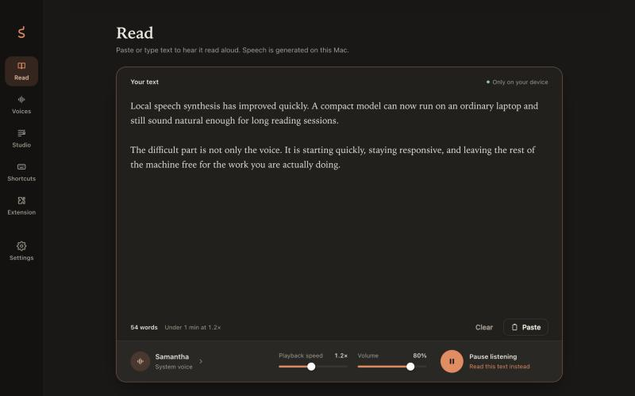
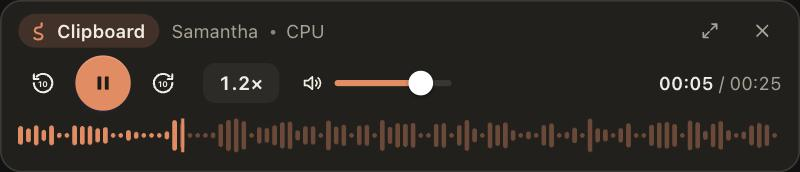
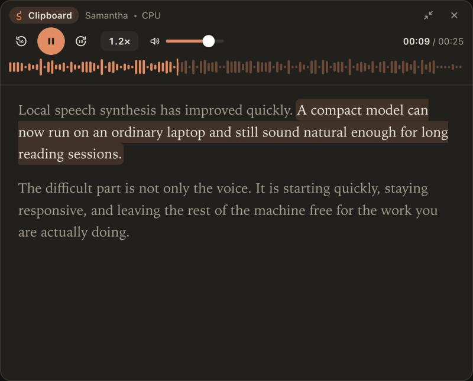
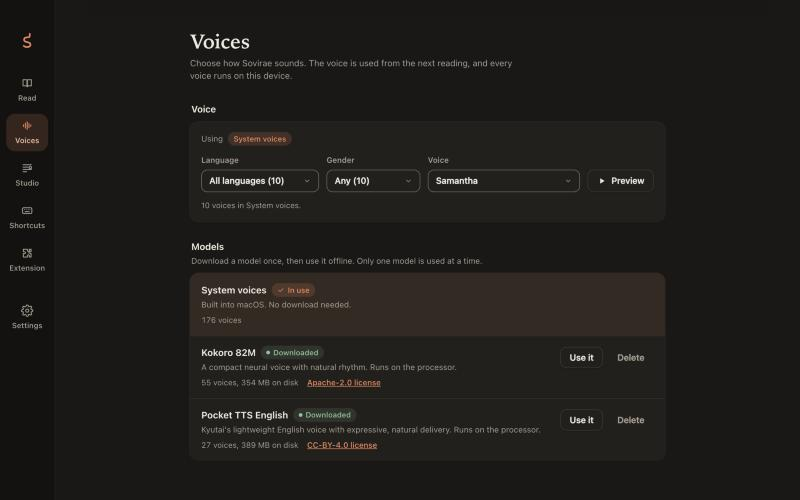
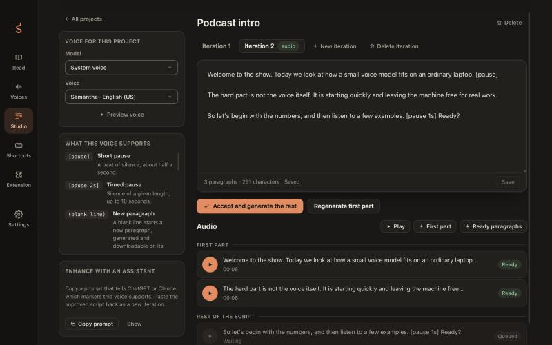
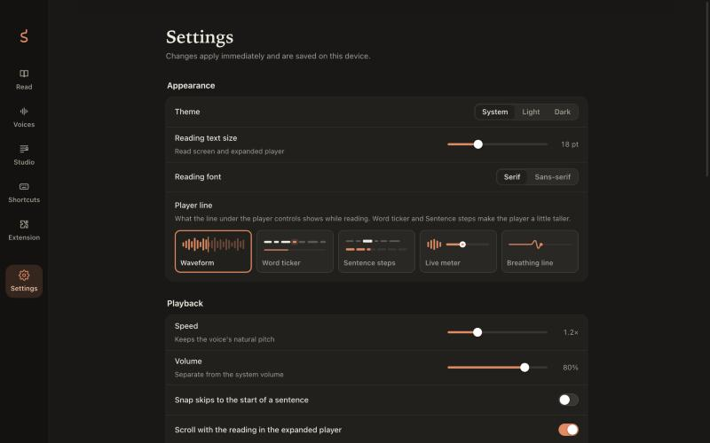

# Sovirae

Read-aloud for your computer: Markdown files, docs, blog posts, emails, or any
text you copy or select, spoken by an AI voice that runs entirely on your own
machine. Nothing leaves your device.

**[Download the latest release](https://github.com/vishalnimbalkar55/sovirae/releases/latest)**
for macOS (Apple Silicon) and Windows (x64).

## Why I built it

I built Sovirae because of how I work. While coding and researching, AI tools
hand me long answers as Markdown files, and on top of that there are blogs,
docs, and emails I want to get through. Reading all of it properly takes deep
focus, and often I need to do something else at the same time. So I made an
app that reads it to me: paste a Markdown file, select a paragraph in the
browser, or copy an email, and a local AI voice reads it while I keep
working. Markdown syntax is stripped, so headings, links, and code marks are
not read out as symbols.

## Screenshots

**Read.** Paste or type text and listen. The word count and listening time
update as you type.



**Floating player.** Stays above other windows while you work: pause, skip
ten seconds, change speed without changing pitch, and a live waveform.



**Expanded player.** Shows the text and follows the sentence being read.



**Voices.** System voices out of the box; download Kokoro or Pocket TTS once
and use them offline. Filter by language and gender, and preview before
choosing.



**Studio.** Turn a script into a recording, paragraph by paragraph, and
download it as WAV.



**Settings.** Theme, reading font, player style, playback, resource profile,
pronunciation rules, and background behaviour.



## What it does

- **Reads anything you give it.** Paste text, press a global shortcut to read
  the clipboard, or use the Chrome extension to read a selection or a block
  you pick on any page. Markdown is cleaned up before it is spoken.
- **Runs locally.** macOS and Windows system voices work immediately. Kokoro-82M
  (55 voices, 8 languages) and Kyutai Pocket TTS (27 voices each in English,
  French, German, Spanish, Italian, Portuguese, and Dutch) download once from
  inside the app and then run on your CPU, or on the GPU on Apple Silicon and
  NVIDIA.
- **Stays out of your way.** A floating player with global shortcuts, a menu
  bar icon, and resource profiles that keep the rest of the machine
  responsive: capped inference threads, below-normal worker priority, and the
  voice model unloaded after a few idle minutes.
- **Reads the way you want.** Speed from 0.5× to 3× with natural pitch,
  sentence snapping, a voice per language for web pages, and pronunciation
  rules for names and acronyms.
- **Studio.** Script projects with iterations, their own voice, pauses and
  approximate expressions, a prompt you can give ChatGPT or Claude to improve
  the script, and WAV export of the first part or the whole recording.

## Install

Download from the [releases page](https://github.com/vishalnimbalkar55/sovirae/releases/latest).

| File | For |
|---|---|
| `Sovirae_<version>_aarch64.dmg` | macOS 13 or later on Apple Silicon. Drag Sovirae to Applications. |
| `Sovirae_<version>_x64-setup.exe` | Windows 10 (1803 or later) or 11, 64-bit. Installs for the current user. |
| `Sovirae_<version>_x64-portable.zip` | Windows, no installation: unzip and run `Sovirae.exe`. |
| `Sovirae_<version>_chrome-extension.zip` | The Chrome extension, for *Load unpacked* (the app also carries a copy). |

The builds are not signed with a developer certificate, so each system warns
once on first launch. On macOS, open *System Settings › Privacy & Security*
and choose **Open Anyway**; on Windows, choose **More info › Run anyway** on
the SmartScreen notice.

On macOS you can skip the warning by clearing the quarantine flag after
copying Sovirae to Applications:

```bash
xattr -dr com.apple.quarantine /Applications/Sovirae.app
```

Kokoro voices on macOS need `espeak-ng` (`brew install espeak-ng`); on
Windows it is included. Neural voices are downloaded inside the app under
Voices.

## How it works

Tauri 2 with a React UI and a Rust core. Each neural model runs in its own
worker process (ONNX Runtime for Kokoro, a Rust port of Kyutai's model on
Candle for Pocket TTS), so a crash or a hang never takes the app down and
cancelling a reading is immediate. A session controller owns the sentence
index and the audio schedule: the first sentence is synthesized first, the
rest a bounded distance ahead of playback. The product spec lives in
[`spec/`](spec/README.md); progress is tracked in the step files there.

## Build the complete project

One command checks prerequisites, installs packages, runs every test, and
builds the app, installer, and Chrome extension for every platform this
computer can build. It works the same on macOS and Windows:

```bash
npm run build:all
```

Everything ends up in `build/` (each platform folder is cleared and refilled):

```
build/macos/Sovirae.app                       the macOS app            (built on a Mac)
build/macos/Sovirae_0.1.0_aarch64.dmg         the macOS installer
build/macos/Sovirae_0.1.0_macos.zip           the app, zipped
build/windows/Sovirae_0.1.0_x64-setup.exe     the Windows installer    (built on Windows, or on a
                                              Mac set up for cross-builds)
build/windows/Sovirae_0.1.0_x64-portable.zip  unzip and run Sovirae.exe, no install
build/ext/                                    the Chrome extension, for Load unpacked
build/Sovirae_0.1.0_chrome-extension.zip      the same, zipped (manifest at the root, as the
                                              Chrome Web Store expects)
```

On Windows, Kokoro's NVIDIA GPU support adds ~1.3 GB of NVIDIA libraries.
They are included once `npm run fetch:cuda` has downloaded them (only the
display driver is needed, not the CUDA toolkit); `-- --no-gpu` builds without
them.

Options: `-- --skip-tests`, `-- --no-install` (reuse `node_modules`; use it
while `npm run app:dev` is running, which locks files there), `-- --no-gpu`, and
`-- --mac` / `-- --windows` to build one platform, e.g.
`npm run build:all -- --windows`. `npm run app:build` is the quick form
(no tests, no reinstall). To copy the last builds into `build/` again without
rebuilding:

```bash
npm run build:collect
```

A full macOS build takes about 3 minutes from a warm cache (longer the first
time, while Rust and ONNX Runtime download).

### Windows installer from a Mac (optional, experimental)

A Mac can also cross-build the Windows installer. Set it up once; the script
asks you to accept Microsoft's license for the Windows SDK that cargo-xwin
downloads, then installs NSIS, LLVM, cargo-xwin, and the Rust target:

```bash
npm run setup:windows-cross
```

After that `npm run build:all` fills both `build/macos/` and `build/windows/`.
Without it, the Mac build skips Windows with a warning. Test cross-built
installers on a Windows PC.

### Prerequisites on Windows (Windows 10 1803+ or 11, x64)

| Tool | Install |
|---|---|
| Visual Studio 2022 Build Tools | "Desktop development with C++" workload |
| Rust (stable, MSVC) | from rustup.rs (`rustup default stable-msvc`) |
| Node.js 22+ | from nodejs.org |

Windows support is being ported in phases; see
[spec/steps/14-windows-support.md](spec/steps/14-windows-support.md).

### Prerequisites (macOS 13 or later; built and tested on Apple Silicon)

| Tool | Install |
|---|---|
| Xcode Command Line Tools | `xcode-select --install` |
| Rust (stable) | `curl https://sh.rustup.rs -sSf \| sh` |
| Node.js 22+ | from nodejs.org or `brew install node` |
| espeak-ng (for Kokoro voices) | `brew install espeak-ng` |

`build:all` stops with a clear message if a required tool is missing and warns
if espeak-ng is absent (the app still builds; system voices still work).

### What the build contains

`Sovirae.app/Contents/MacOS/` holds four programs:

| File | Role |
|---|---|
| `sovirae` | The app: windows, player, shortcuts, menu bar icon |
| `sovirae-kokoro-worker` | Kokoro inference in its own process (ONNX Runtime built in) |
| `sovirae-pocket-worker` | Pocket TTS inference in its own process (Candle, Apple Accelerate) |
| `sovirae-native-host` | Connects Chrome to the app |

`build/ext/` is the Chrome extension, ready for **Load unpacked** (the app also carries a copy in `Contents/Resources/ext/`).
Neural voice models are not bundled; download them in Sovirae › Voices.

The build is ad-hoc signed, which is fine on the machine that built it. To
share it, sign and notarize with an Apple Developer ID.

## Publishing a release

Releases are built by hand: the macOS app on a Mac, the Windows installer
on a Windows PC, then both uploaded to one GitHub Release with the GitHub
CLI (`brew install gh` or `winget install GitHub.cli`, then `gh auth login`
once).

1. Bump the version in `src-tauri/tauri.conf.json`, `package.json`, and the
   workspace `Cargo.toml`, commit, and tag:

   ```bash
   git tag -a v0.1.1 -m "Sovirae 0.1.1" && git push origin main v0.1.1
   ```

2. On the Mac, build and create the release with the macOS files and the
   extension zip:

   ```bash
   npm run build:all -- --mac
   gh release create v0.1.1 --verify-tag --title "Sovirae 0.1.1" --generate-notes build/macos/*.dmg build/macos/*_macos.zip build/*_chrome-extension.zip
   ```

3. On the Windows PC, build and add the installer and portable zip to the
   same release:

   ```powershell
   npm run build:all
   gh release upload v0.1.1 build\windows\*-setup.exe build\windows\*-portable.zip
   ```

The builds are ad-hoc signed, so macOS and Windows warn once on first
launch; say so in the release notes. To ship without the warnings, sign and
notarize the macOS app with an Apple Developer ID and sign the Windows
installer with a code-signing certificate.

## Studio

The Studio screen turns a script into a downloadable recording. Create a
project, paste a script, choose a model and voice for it, and generate the
first part. Listen, accept, and the remaining paragraphs are generated.
Scripts can use `[pause]`, `[pause 2s]`, and expressions such as `[laugh]`
or `[clear throat]`, which every voice approximates with a spoken sound; a
model that understands its own tags (listed under `features` in the catalog)
shows them next to the editor instead. "Copy prompt" produces a prompt for
ChatGPT or Claude that only uses those markers. Projects and their WAV files
live in the app data folder under `studio/`.

## Logs

Warnings and errors (voice engine failures, GPU fallback reasons, download
and bridge problems) are written to `sovirae.log` in the app's log folder:
`~/Library/Logs/com.sovirae.desktop/` on macOS and
`%LOCALAPPDATA%\com.sovirae.desktop\logs\` on Windows. The file is capped
at 2 MB and one previous copy is kept. If a window ever opens blank, the
log says whether its page loaded and what the interface reported.

## Everyday commands

| Task | Command |
|---|---|
| Build everything (tests + app + installer + extension) | `npm run build:all` |
| Set up a Mac to also build the Windows installer (once) | `npm run setup:windows-cross` |
| Download the NVIDIA GPU libraries for Windows builds (once, ~950 MB) | `npm run fetch:cuda` |
| Build without tests | `npm run app:build` |
| Copy the last build into `build/` again (no rebuild) | `npm run build:collect` |
| Run in development (hot reload) | `npm run app:dev` |
| Run all tests (Rust + extension) | `npm test` |
| Work on the UI in a browser with sample data | `npm run dev`, then open `http://localhost:1420` |

Longer checks that play audio or need a downloaded model are opt-in:

```bash
cargo test -p sovirae -- --ignored          # real playback, including Kokoro and Pocket TTS
python3 scripts/check-bridge.py             # Chrome bridge, 22 checks (extension must be allowed)
cargo run --release -p speakit-tts --example kokoro_bench -- \
  "$HOME/Library/Application Support/com.sovirae.desktop/models" fp32 /tmp/kokoro-wav
cargo run --release -p speakit-tts --example pocket_bench -- \
  "$HOME/Library/Application Support/com.sovirae.desktop/models" /tmp/pocket-wav
```

## Chrome extension

1. Start Sovirae once so it registers its connection with Chrome, Edge, Brave,
   Chromium, Vivaldi, and Arc.
2. Open `chrome://extensions`, turn on **Developer mode**, choose **Load
   unpacked**, and select `build/ext` (or Sovirae › Extension › Show folder).
   In development you can load [`ext/`](ext/) directly.
3. Select text and press **⌥⇧S**, right-click › **Read with Sovirae**, or hold
   **Option** to pick part of a page. Allow Chrome the first time Sovirae asks.

The extension ID is fixed at `jhbbmlhbjhjdepmaebpniefhaoljfgoe` by the `key` in
`ext/manifest.json`. The matching private key (only needed to pack a `.crx`) is
kept outside the repository in
`~/Library/Application Support/com.sovirae.desktop/keys/`.

## Layout

| Path | What |
|---|---|
| `src/` | React UI: main window and floating player |
| `src-tauri/` | Tauri shell: session controller, shortcuts, tray, models, Chrome bridge |
| `crates/speakit-core` | Text validation, normalization, sentence index |
| `crates/speakit-audio` | Audio output and pitch-preserving speed |
| `crates/speakit-tts` | System voices, Kokoro and Pocket TTS engines, phonemizer, engine registry |
| `crates/speakit-models` | Model catalog (`catalog/models.json`) and verified downloads |
| `crates/speakit-protocol` | Chrome bridge message format |
| `workers/speakit-kokoro-worker` (`sovirae-kokoro-worker`) | Isolated ONNX inference process |
| `workers/speakit-pocket-worker` (`sovirae-pocket-worker`) | Isolated Pocket TTS inference process (Rust port of Kyutai's model) |
| `workers/speakit-native-host` (`sovirae-native-host`) | Chrome native messaging relay |
| `ext/` | Chrome MV3 extension |
| `docs/screenshots/` | The images in this README, taken from the UI preview with sample data |
